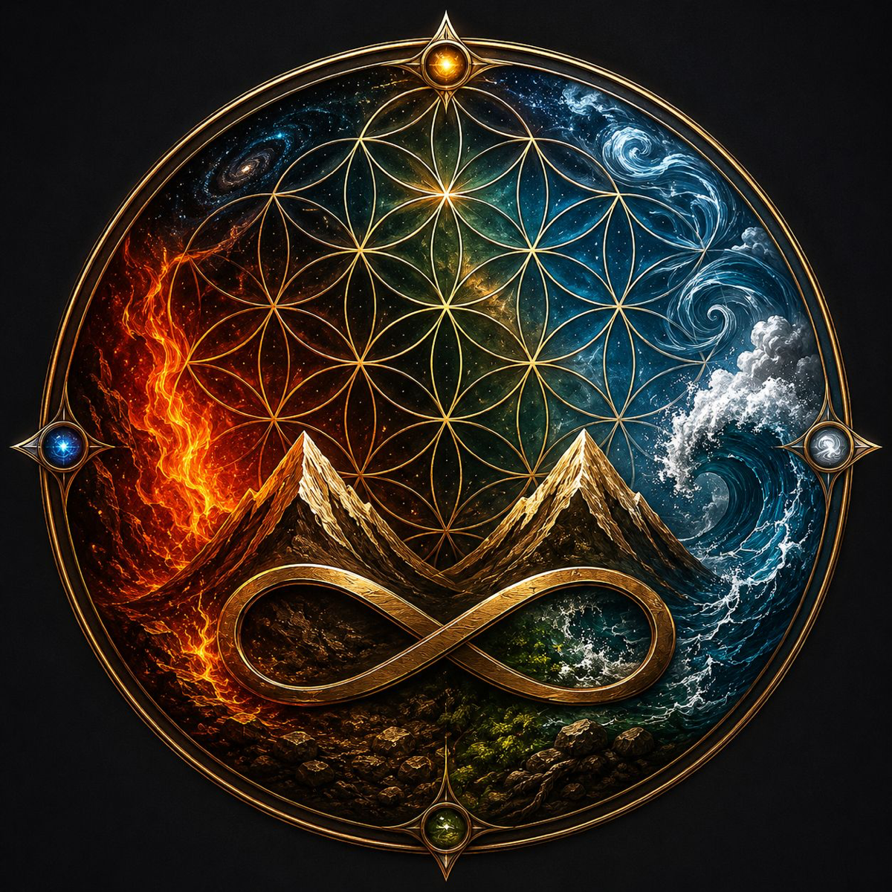

# Zagros Amanos

> *İki dağ — bir tek isim. Doğu'dan Batı'ya, Mezopotamya'dan Akdeniz'e bir köprü.*
> *Sınırlar çizildi, imparatorluklar geldi geçti, dağlar ayakta kaldı.*

<p align="center">
  
</p>

<p align="center">
  <strong>Manifesto · 2026 · Public Domain</strong><br/>
  <a href="https://zagrosamanos.com">zagrosamanos.com</a>
</p>

---

## 🇹🇷 Türkçe

**Zagros Amanos** halklar üstü, sınır tanımayan, çağlar boyu insanlığın iki dağ etrafında ördüğü yaşamı anlatan bir manifestodur. **Hiçbir şirkete, partiye, kuruma ait değildir. Bütün insanlığa aittir.**

Bu depo, manifestoyu **özgürce paylaşmak, çevirmek, yorumlamak ve geliştirmek isteyen herkese** açıktır.

**Ne yapabilirsin:**

- 📖 **Oku** — `manifesto/original/ZAGROS-AMANOS-TR.pdf`
- 🌍 **Çevir** — kendi dilinde yorumla (Kurmancî, Soranî, Arapça, Farsça, İngilizce, Almanca, Yunanca, Ermenice, Süryanice...)
- ✍️ **Açıklama yaz** — `annotations/` klasörüne yorum ekle
- 💬 **Tartış** — Issues sekmesinden konu aç
- 🛠️ **Yazılım yap** — `tools/` altına web reader, e-book üretici, bot, mobil uygulama
- 🎨 **Sanat üret** — `assets/` altına illüstrasyon, sesli okuma, video, fotoğraf
- 💡 **Fikir paylaş** — Discussions tab'inde tartışma aç
- 📤 **Paylaş** — bağlantısını ver, alıntıla, yayınla

**Her şey CC0 — kamu malı.** Telif yok, izin gerekmiyor.

---

## 🇬🇧 English

**Zagros Amanos** is a manifesto about the life that humanity has woven for ages around two mountain ranges — beyond borders, beyond peoples, beyond empires. **It belongs to no company, no party, no institution. It belongs to all of humanity.**

This repository is **open to anyone** who wants to read, translate, annotate, and freely share the manifesto.

**What you can do:**

- 📖 **Read** — `manifesto/original/ZAGROS-AMANOS-TR.pdf`
- 🌍 **Translate** into your language (Kurdish dialects, Arabic, Persian, English, German, Greek, Armenian, Syriac…)
- ✍️ **Annotate** — add commentary in the `annotations/` folder
- 💬 **Discuss** — open an issue
- 🛠️ **Build tools** — put web readers, e-book generators, bots, mobile apps under `tools/`
- 🎨 **Make art** — illustrations, audio readings, videos, photography under `assets/`
- 💡 **Share ideas** — open a Discussion
- 📤 **Share** — link, quote, publish, broadcast

**Everything is CC0 — public domain.** No copyright, no permission needed.

---

## 🇰🇺 Kurmancî

**Zagros Amanos** manîfestoyek e li ser jiyana ku mirovahî bi sedan salan li dora du çiyayan ava kiriye — bê sînor, bê dewlet, bê xwedan. **Ne yê tu pargîdaniyê, ne yê tu partiyê, ne yê tu sazgehê. Yê hemû mirovahiyê ye.**

Ev depo **vekirî ye ji her kesê** ku bixwaze manîfestoyê bixwîne, wergerîne, şîrove bike û belav bike.

---

## ✊ Felsefe / Philosophy / Felsefe

> **Zagros** — Anadolu'dan İran'a uzanan büyük dağ silsilesi. Kürtlerin, Farsların, Arapların, Türklerin eteklerinde birlikte yaşadığı dağ. Devleti olmayan bir halka binlerce yıl yurt oldu. **Dayanıklılığın sembolüdür.**
>
> **Amanos** — bugünün Hatay-Maraş hattındaki Nur Dağları. Binlerce yıldır Türkçe, Arapça, Ermenice, Süryanice, Rumca burada konuşulur. Hıristiyanlık ilk burada adını aldı. **Çeşitliliğin sembolüdür.**
>
> İki dağ. Bir tek isim. **Bütün insanlığın iki dağı.**

---

## 🌳 Repo Yapısı / Structure

```
zagros-amanos-manifesto/
├── manifesto/
│   ├── original/              ← Orijinal PDF (Türkçe)
│   ├── translations/          ← Çeviriler (her dil için klasör)
│   │   ├── en/  ku/  ar/  fa/  de/  el/  hy/  ...
│   └── cover/                 ← Kapak görseli
│
├── annotations/               ← Yorumlar, akademik notlar
├── discussions/               ← Uzun-form tartışmalar
│
├── tools/                     ← 🛠️ Yazılım, web aracı, bot, mobil uygulama
│   └── README.md              ← Hangi tür projeler eklenebilir
│
├── assets/                    ← 🎨 İllüstrasyon, ses, video, fotoğraf
│   ├── illustrations/  audio/  video/  photography/  typography/
│
├── CONTRIBUTING.md            ← Nasıl katkıda bulunulur
├── CODE_OF_CONDUCT.md         ← Topluluk kuralları
├── LICENSE                    ← CC0 1.0 (Public Domain)
└── README.md                  ← Bu dosya
```

## 🛠️ Geliştiriciler için — Build Anything

Manifesto bir **metin** — ama insanlar bu metni okuyabilsin, çevirebilsin, paylaşabilsin diye **araçlara** ihtiyaç var. İşte fikirler:

- 📖 **Web Reader** — Markdown'ları güzel tek bir siteye dönüştüren static site generator
- 🔍 **Search** — Tüm çeviriler içinde aranabilir indeks
- 📚 **E-book Builder** — EPUB, MOBI, PDF otomatik export
- 🎙️ **Audiobook** — TTS veya insan sesi kayıtları
- 🌐 **Translation Aligner** — Yan yana karşılaştırma aracı
- 🤖 **Bots** — Discord, Telegram, Twitter günlük alıntı botları
- 🧩 **Browser Extension** — Sayfa okurken not alma
- 📱 **Mobile App** — Manifesto okuyucu (iOS, Android, React Native, Flutter — özgürce)
- 📊 **Data Analysis** — Kelime sıklığı, tema haritası, görselleştirme

Her teknoloji serbest. Her dil serbest. Tek kural: **CC0 lisansı ile katkıda bulun.**

---

## 🤝 Nasıl Katkıda Bulunabilirim?

[**CONTRIBUTING.md**](CONTRIBUTING.md)'yi oku. Kısaca:

1. **Bir konu (issue) aç** — yapmak istediğini paylaş
2. **Fork et** — kendi kopyanı al
3. **Çalışmanı yap** — çeviri, yorum, düzeltme
4. **Pull request gönder** — bize geri yolla
5. **Onay sonrası** — değişiklik manifestonun parçası olur

**Çeviri yapacaksan:**
- `manifesto/translations/[dil-kodu]/` klasörü oluştur (örn: `manifesto/translations/en/`)
- Markdown formatında (`.md`) yaz, böylece herkes okuyabilir/iyileştirebilir
- Bölüm bölüm gidebilirsin — komple bitirmek zorunda değilsin

**Yorum yazacaksan:**
- `annotations/` altına `senin-adın-konu.md` dosyası ekle
- Akademik, kişisel, eleştirel — her türlü yorum makbul

---

## 📜 Lisans / License

**[CC0 1.0 Evrensel — Kamu Malı Adanışı](LICENSE)**  
**[CC0 1.0 Universal — Public Domain Dedication](LICENSE)**

Bu manifesto **kamuya armağandır**. Telif hakkı talep edilemez. Ticari, akademik, kişisel — her türlü kullanım serbest. Atıf zorunlu değildir, ama hoş olur.

This manifesto is **dedicated to the public domain**. No copyright reserved. Use commercially, academically, personally — freely. Attribution not required, but appreciated.

---

## 🌐 İletişim / Contact

- **Website:** [zagrosamanos.com](https://zagrosamanos.com)
- **E-posta:** com@zagrosamanos.com
- **GitHub Issues:** projeyle ilgili her şey için

---

<p align="center">
  <em>Wek du çiyayên pişt re ye · Sırtını dayadığın iki dağ gibi · Like two mountains at your back</em>
</p>
